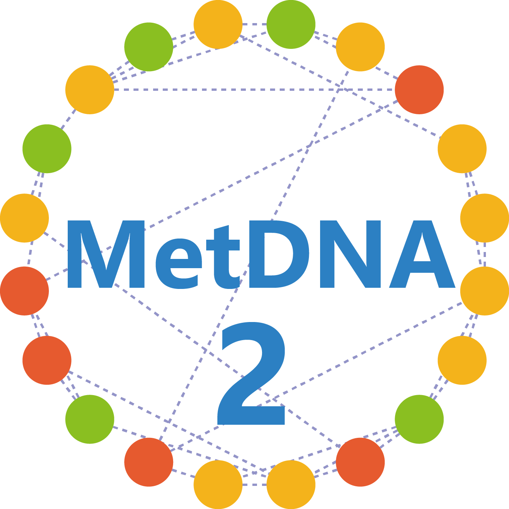

# MetDNA2 

## About
**MetDNA2** excutes **knowledge-guided multi-layer metabolic network** to annotate metabolites from knowns to unknowns. Generally, the KGMN supports  
The KGMN accepts various data imports from common data processing tools, including XCMS, MS-DIAL, and MZmine2. It also support the connection with other metabolomics workflow, like MetFrag, MS-FINDER, MASST etc.

The completed functions are provided in the [**MetDNA2 webserver**](http://metdna.zhulab.cn/) via a free registration. The detailed tutorial was also provided in the MetDNA2 webserver.

## Installation
You can install `MetDNA2` from [Github](https://github.com/ZhuMetLab/MetDNA2).

```
if (!require(devtools)){
    install.packages("devtools")
}

if (!require(BiocManager)){
    install.packages("BiocManager")
}

# Required packages
required_pkgs <- c("dplyr","tidyr","readr", "stringr", "tibble", "purrr",
"ggplot2", "igraph", "pbapply", "Rdisop", "randomForest", "pryr", "BiocParallel", "magrittr", "rmarkdown", "caret")
BiocManager::install(required_pkgs)

# Install ZhuLab related packages
devtools::install_github("ZhuMetLab/SpectraTools")
devtools::install_github("ZhuMetLab/MetBioInterpretation")

# Install `MetDNA2` from GitHub
devtools::install_github("ZhuMetLab/MetDNA2")
```

**Note:** Due to the limitation of copyright, the library objects `zhuMetLib`, `zhuMetlib_orbitrap`, `zhuRPlib`, `lib_rt`, `lib_ccs` are removed in this package. If you want to use the R package, please use your own libray insteaded, and repackage.

## Get started
### Input
Generally, MetDNA requires the import of the following files for metabolite identifications, including:

1. A MS1 peak table (.csv format, **required**). The first three columns must be "name" , "mz" , and "rt".
2. MS2 data files (.mgf or .msp format, **required**). 
3. A table for sample information (.csv format, **required**). The first three columns must be "sample.name" and "group".
4. A RT recalibration table (.csv format, **optional**). If you would like to follow our published LC method and recalibrate the RT library. The gradient of LC are provided [here](http://metdna.zhulab.cn/metdna/help#demodata).

The step-by-step tutorials are provided in the [**MetDNA2 website**](http://metdna.zhulab.cn/metdna/help) and the later parts.


### Output
The results should be looks like below:

</p>
<br><br>

- The `00_annotation_table` contains annotation results:
    - The <b>table1_identification.csv</b> contains base peak annotated candidates.
    - The <b>table2_peak_group.csv</b> records annotated abiotic peaks in each peak group.
    - The <b>table3_identification_pair.csv</b> is same as table 1, but organized as feature-metabolite pairs.

### Running on RStudio or R
```
# load package
library(MetDNA2)

# run MetDNA2
runMetDNA2(
	path_pos = "working_directory/POS",
	path_neg = "working_directory/NEG",
	metdna_version = "version2",
	polarity = "positive",
	instrument = "SciexTripleTOF",
	column = "hilic",
	ce = "30",
	method_lc = "Other",
	correct_p = FALSE,
	extension_step = "2",
	comp_group = c("W30", "W03"),
	species = "hsa",
	p_cutoff = 0.050000,
	fc_cutoff = 1.000000,
	is_rt_calibration = FALSE)
```

### Demo data set and Runtime
Generally, it requires 4-8 hours to complete a project, which depends on the number of features and MS/MS spectra. The raw MS data can be found the repository ([NIST urine](https://www.biosino.org/node/project/detail/OEP003157), [Fruit fly](https://www.ebi.ac.uk/metabolights/MTBLS612/descriptors)). 

Project | Running time (hours) | Download
---|--- | ---
NIST urine (Pos) | 5.4 h | [Here](https://mega.nz/file/w7ZnjLAa#u4Dj5lhkYyEhOZHH4BX_HUHvGMkjZ_ti5bn986tgyrY)
NIST urine (Neg) | 8.8 h | [Here](https://mega.nz/file/kjoDhJBD#0BTqTZDuzbI_06aEXb8dtUo1z_1kqtp2FIIEyqpx_cU) 
Head tissue of fruit fly (Pos) | 5.0 h | [Here](https://mega.nz/file/Fy5GRAxA#FKSfmzUZrZFpVy1lvSYlUzKWj_ELVY6C-hm_fUqZ1zk) 
Head tissue of fruit fly (Neg) | 5.9 h | [Here](https://mega.nz/file/syZ2jQBJ#WgM92sNXHydGj1jCMOcXsa7tnDwXUCEtWi7GO9w1VT0)

### Connection with other metabolomics workflows
The KGMN is a versatile tool to compatible with various data processing tools and analysis workflow in metabolomics community. 

- **Note**: we provide two packages [MetDNA2InSilicoTool](https://github.com/ZhuMetLab/MetDNA2InSilicoTool) and [MetDNA2Vis](https://github.com/ZhuMetLab/MetDNA2Vis) to help user to intergrate with in-silico MS/MS tools and visualize networks, respectively.

No. | Tool | Usage | Version | Tutorial 
--- | --- | --- | --- |  --- 
1 | XCMS | Peak picking (Input of KGMN) | >= v1.46.0  |  [Tutorial](http://metdna.zhulab.cn/metdna/help#3.1) 
2 | MS-DIAL | Peak picking (Input of KGMN) | >= V4.60 |  [Tutorial](http://metdna.zhulab.cn/metdna/help#3.2) 
3 | MZmine | Peak picking (Input of KGMN) | >= V3.0.21 |  [Tutorial](https://github.com/ZhuMetLab/MetDNA2_Web/blob/main/Tutorials/Tutorial_data_preprocessing_MZmine.pdf) 
4 | MetFrag | Cross evaluation of KGMN metabolites | >= V2.4.5 | [Tutorial](https://github.com/ZhuMetLab/MetDNA2_Web/blob/main/Tutorials/Tutorial_KGMN_and_insilico_ms2.pdf) 
5 | CFM-ID | Cross evaluation of KGMN metabolites | >= V2.4 | [Tutorial](https://github.com/ZhuMetLab/MetDNA2_Web/blob/main/Tutorials/Tutorial_KGMN_and_insilico_ms2.pdf) 
6 | MS-FINDER | Cross evaluation of KGMN metabolites | >= V3.24 | [Tutorial](https://github.com/ZhuMetLab/MetDNA2_Web/blob/main/Tutorials/Tutorial_KGMN_and_insilico_ms2.pdf) 
7 | MASST | Repository search | Workflow29 | [Tutorial](https://github.com/ZhuMetLab/MetDNA2_Web/blob/main/Tutorials/Tutorial_KGMN_and_MASST.pdf) 
8 | Cytoscape | Visualization of KGMN | >= V5.8.3 | [Tutorial](https://github.com/ZhuMetLab/MetDNA2_Web/blob/main/Tutorials/Tutorial_visualization.pdf) 


## Need help?
If you have any problems or bug reports, please contact us with the following materials. We will answer your questions at 1:00 pm - 3:00 pm (Beijing time) on every Friday.
- We always welcome any discussions and bug reports about MetDNA via google group: [**MetDNA forum**](https://groups.google.com/g/metdna).
- For **Chinese users**, please join our QQ group for any discussions and bug reports: **786156544**.

## Citation
This free open-source software implements academic research by the authors and co-workers. If you use it, please support the project by citing the appropriate journal articles.

Zhiwei Zhou†, Mingdu Luo†, Haosong Zhang, Yandong Yin, Yuping Cai, and Zheng-Jiang Zhu*, Metabolite annotation from knowns to unknowns through knowledge-guided multi-layer metabolic network, **Submitted**, 2022. [**bioRxiv**](https://doi.org/10.1101/2022.06.02.494523)

## License
<a rel="license" href="https://creativecommons.org/licenses/by-nc-nd/4.0/"></a> 
This work is licensed under the Attribution-NonCommercial-NoDerivatives 4.0 International (CC BY-NC-ND 4.0)
